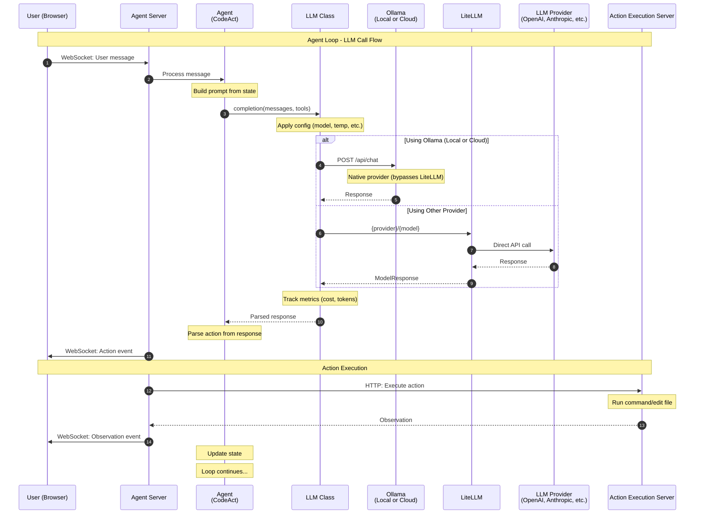

# Agent Execution & LLM Flow

When the agent executes inside the sandbox, it makes LLM calls through LiteLLM or directly via the native Ollama provider:



### LLM Components

| Component | Purpose | Location |
|-----------|---------|----------|
| **LLM Class** | Wrapper with retries, metrics, config | `openhands/llm/llm.py` |
| **Ollama Provider** | Native Ollama client (bypasses LiteLLM) | `openhands/llm/ollama_provider.py` |
| **LiteLLM** | Universal LLM API adapter (free library) | External library |
| **LLM Registry** | Manages multiple LLM instances | `openhands/llm/llm_registry.py` |

### Model Routing

```
User selects model
        │
        ▼
┌───────────────────┐
│ Provider?         │
└───────────────────┘
        │
        ├── ollama/llama3.2       ──► Native Ollama provider (local)
        │                              Direct HTTP to localhost:11434
        │
        ├── anthropic/claude-3-5  ──► Direct to Anthropic API
        │                              (User's API key via LiteLLM)
        │
        ├── openai/gpt-4          ──► Direct to OpenAI API
        │                              (User's API key via LiteLLM)
        │
        └── azure/gpt-4           ──► Direct to Azure OpenAI
                                       (User's API key via LiteLLM)
```

### Local LLM Setup

For local Ollama models, set these in your config:
- `provider = "ollama"`
- `model = "ollama/llama3.2-vision:11b"` (or any Ollama model)
- `base_url = "http://localhost:11434"`
- `api_key = "ollama"` (placeholder, not used)
